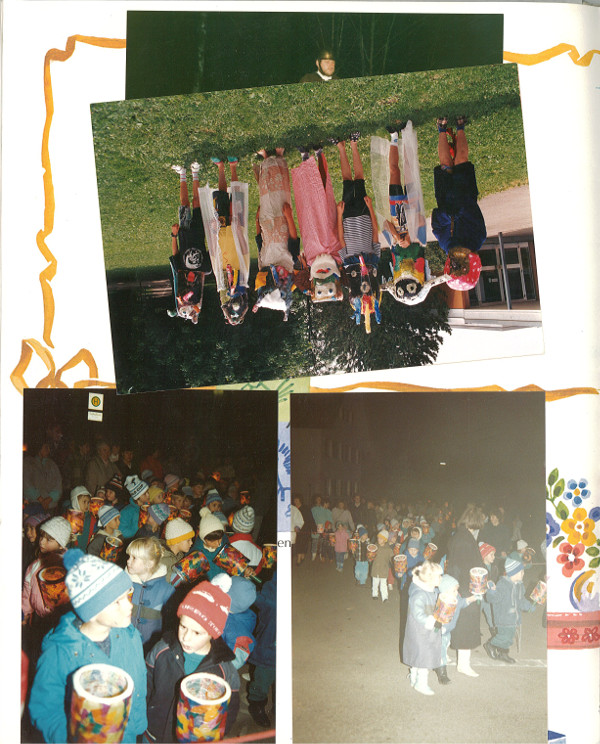
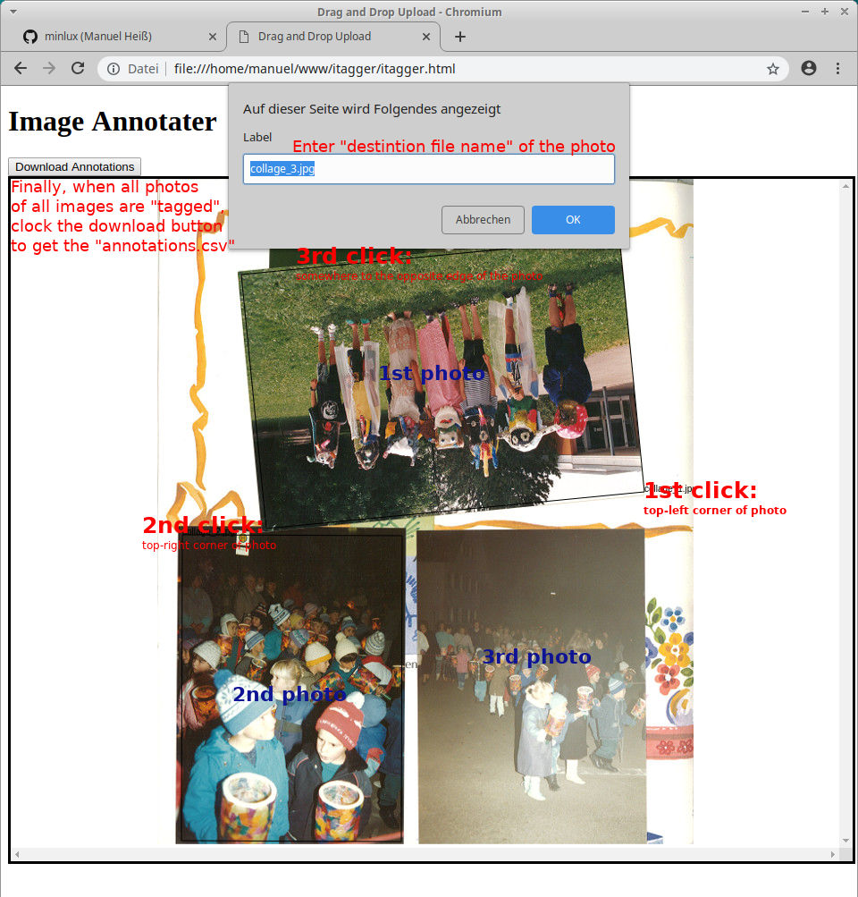
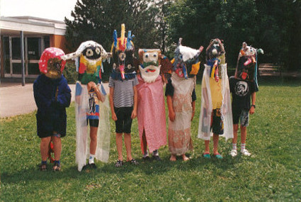
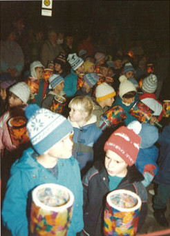
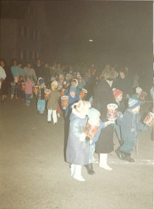

# Image Tagger
"Toolset" to exctract multiple pictures out of one or more "multi-picture-images".
E.g. extract (crop and rotate) multiple scanned photos fotos via batch.

## TODOs and Hints
TODO - add description.
Works (currently) only in Chrome browser.
Requires linux and imagemagick's "convert" tool.
*itagger.html and *extract* must be in the same folder as the images ...

## Usage Example
The following image contains several photos, that shall be extracted into single images.


To do that, open *itagger.html* in **Chrome** browser.
Drag the "multi-photo-image" into the site.
Start "tagging" of the photos by clicking each photo:
- 1st: top-left corner
- 2nd: top-right corner
- 3rd: somewhere to the bottom edge of the photo
In the popup dialog, add a name destination name for the image file and click OK.
Repeate this step for all photos of the image. When done, drag in the next image
and continue selecting photos.
Finally, click the download button to download a *annotations.csv* file (into the folder of your images).



To start the extraction batch process got to linux command line and create a folde *out* (within the
image folder):
```
mkdir out
```
Then start the extraction process to get the images into the *out* folder:
```
./extract annotations.csv
```

The photos will be extracted into single images:



 


## Internals: Format of CSV-File
- Column 1: Source file
- Column 2: Destination file
- Column 3: Margin-box, x-coordinate
- Column 4: Margin-box, y-coordinate
- Column 5: Margin-box, width
- Column 6: Margin-box, heigth
- Column 7: Image-box, Top-left corner, x-coordinate
- Column 8: Image-box, Top-left corner, y-coordinate
- Column 9: Image-box, width
- Column 10: Image-box, height
- Column 11: Image-box, rotation-angle
- Column 12: 0 (dummy, for termination)
